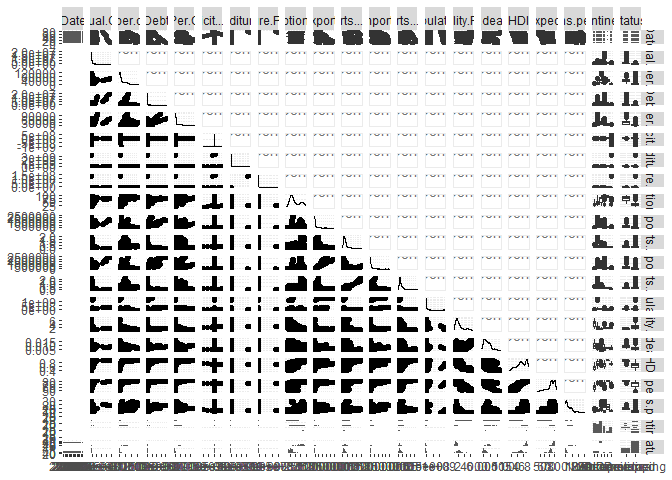
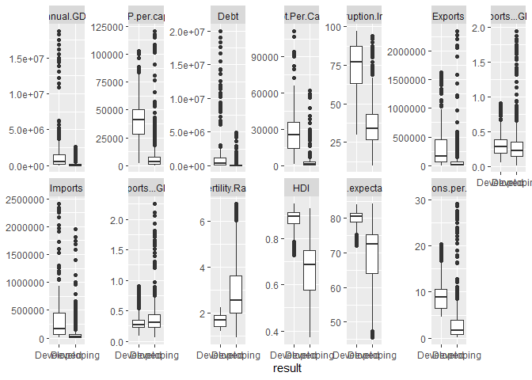
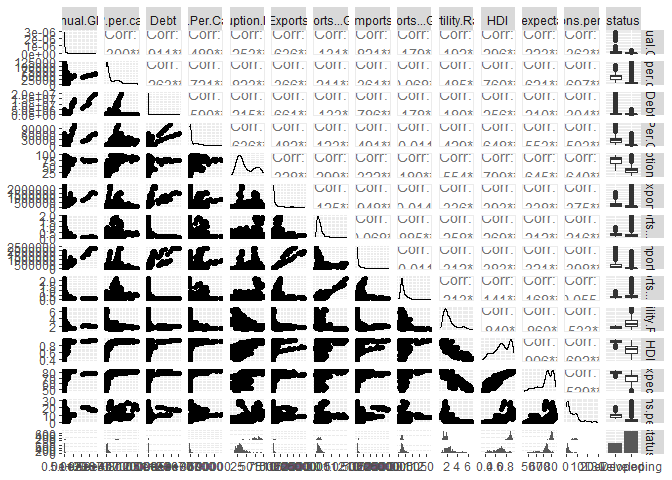
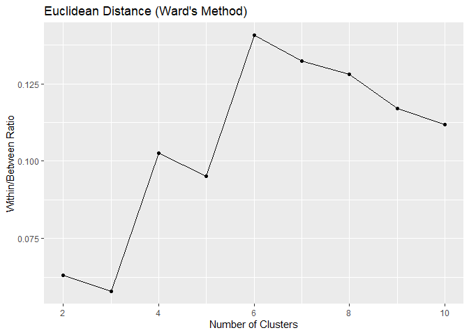
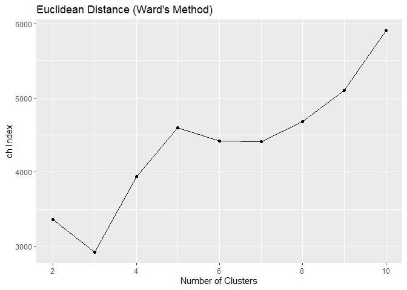
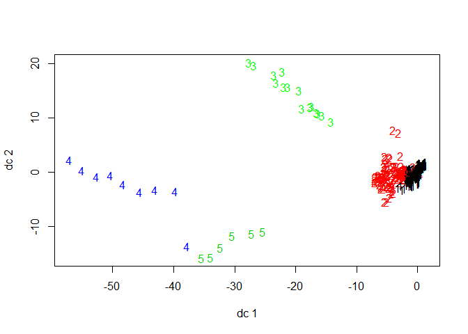
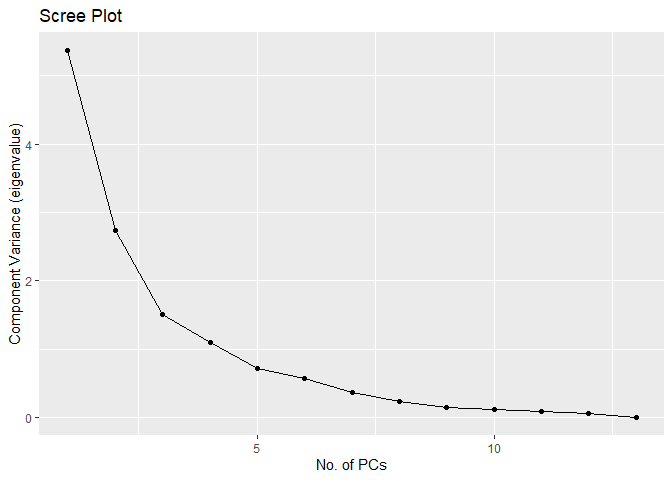
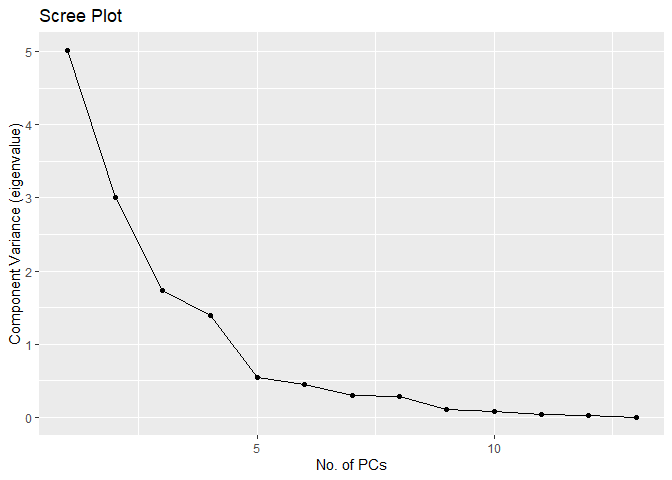

Final Project Report
================
Ben Porter
12/15/2021

``` r
library(ggplot2)
library(GGally)
```

    ## Registered S3 method overwritten by 'GGally':
    ##   method from   
    ##   +.gg   ggplot2

``` r
library(mvShapiroTest)
library(DescTools)
library(reshape2)
library(biotools)
```

    ## Loading required package: MASS

    ## ---
    ## biotools version 4.2

``` r
library(car)
```

    ## Loading required package: carData

    ## 
    ## Attaching package: 'car'

    ## The following object is masked from 'package:DescTools':
    ## 
    ##     Recode

``` r
sampledata <- read.csv("sample-data.csv")
sampledata1 <- sampledata

sampledata1$Date = as.factor(sampledata1$Date)
sampledata1$Continent = as.factor(sampledata1$Continent)
sampledata1$status = as.factor(sampledata1$status)


summary(sampledata1)
```

    ##       X.1               X            Country               Date    
    ##  Min.   :   1.0   Min.   :   1.0   Length:1230        2002   : 82  
    ##  1st Qu.: 308.2   1st Qu.: 308.2   Class :character   2003   : 82  
    ##  Median : 615.5   Median : 615.5   Mode  :character   2004   : 82  
    ##  Mean   : 615.5   Mean   : 615.5                      2005   : 82  
    ##  3rd Qu.: 922.8   3rd Qu.: 922.8                      2006   : 82  
    ##  Max.   :1230.0   Max.   :1230.0                      2007   : 82  
    ##                                                       (Other):738  
    ##    Annual.GDP       GDP.per.capita        Debt          Debt.Per.Capita   
    ##  Min.   :    2984   Min.   :   245   Min.   :     193   Min.   :    26.0  
    ##  1st Qu.:   24140   1st Qu.:  2274   1st Qu.:    8874   1st Qu.:   820.2  
    ##  Median :  132612   Median :  6552   Median :   52184   Median :  2578.0  
    ##  Mean   :  610194   Mean   : 17688   Mean   :  534103   Mean   : 10376.7  
    ##  3rd Qu.:  391884   3rd Qu.: 30772   3rd Qu.:  231176   3rd Qu.: 15887.5  
    ##  Max.   :18715000   Max.   :120449   Max.   :19991190   Max.   :111303.0  
    ##                                                                           
    ##  Deficit...M...       Expenditure..M...   Expenditure.Per.Capita
    ##  Min.   :-971306813   Min.   :3.810e+02   Min.   :       40     
    ##  1st Qu.:     -9493   1st Qu.:5.827e+03   1st Qu.:      509     
    ##  Median :     -1088   Median :3.633e+04   Median :     1943     
    ##  Mean   :   -931519   Mean   :5.788e+06   Mean   :   224743     
    ##  3rd Qu.:       -84   3rd Qu.:1.784e+05   3rd Qu.:    12046     
    ##  Max.   : 594574424   Max.   :3.615e+09   Max.   :141072986     
    ##                                                                 
    ##  Corruption.Index    Exports        Exports...GDP       Imports         
    ##  Min.   :10.00    Min.   :    280   Min.   :0.0181   Min.   :    626.7  
    ##  1st Qu.:30.00    1st Qu.:   6044   1st Qu.:0.1609   1st Qu.:   8406.6  
    ##  Median :40.00    Median :  32152   Median :0.2463   Median :  39654.8  
    ##  Mean   :48.53    Mean   : 146430   Mean   :0.3143   Mean   : 154145.2  
    ##  3rd Qu.:70.00    3rd Qu.: 158357   3rd Qu.:0.3603   3rd Qu.: 161037.3  
    ##  Max.   :97.00    Max.   :2342293   Max.   :1.9427   Max.   :2412547.0  
    ##                                                                         
    ##  Imports...GDP      Population        Fertility.Rate  Crude.death.rate  
    ##  Min.   :0.0556   Min.   :2.885e+05   Min.   :0.900   Min.   :0.003810  
    ##  1st Qu.:0.2291   1st Qu.:6.734e+06   1st Qu.:1.673   1st Qu.:0.005812  
    ##  Median :0.2971   Median :1.634e+07   Median :2.100   Median :0.007360  
    ##  Mean   :0.3616   Mean   :6.521e+07   Mean   :2.553   Mean   :0.007892  
    ##  3rd Qu.:0.4111   3rd Qu.:4.568e+07   3rd Qu.:3.007   3rd Qu.:0.009500  
    ##  Max.   :2.2573   Max.   :1.383e+09   Max.   :6.780   Max.   :0.017520  
    ##                                                                         
    ##       HDI         Life.expectancy CO2.Tons.per.capita         Continent  
    ##  Min.   :0.3700   Min.   :45.40   Min.   : 0.050      Africa       :270  
    ##  1st Qu.:0.6350   1st Qu.:70.13   1st Qu.: 1.150      Asia         :240  
    ##  Median :0.7390   Median :74.70   Median : 3.455      Europe       :345  
    ##  Mean   :0.7325   Mean   :72.84   Mean   : 5.203      North America:195  
    ##  3rd Qu.:0.8750   3rd Qu.:79.73   3rd Qu.: 8.205      Oceania      : 30  
    ##  Max.   :0.9510   Max.   :84.28   Max.   :29.150      South America:150  
    ##                                                                          
    ##         status   
    ##  Developed :375  
    ##  Developing:855  
    ##                  
    ##                  
    ##                  
    ##                  
    ## 

``` r
ggpairs(sampledata1[4:24])
```

    ## `stat_bin()` using `bins = 30`. Pick better value with `binwidth`.

    ## `stat_bin()` using `bins = 30`. Pick better value with `binwidth`.
    ## `stat_bin()` using `bins = 30`. Pick better value with `binwidth`.
    ## `stat_bin()` using `bins = 30`. Pick better value with `binwidth`.
    ## `stat_bin()` using `bins = 30`. Pick better value with `binwidth`.
    ## `stat_bin()` using `bins = 30`. Pick better value with `binwidth`.
    ## `stat_bin()` using `bins = 30`. Pick better value with `binwidth`.
    ## `stat_bin()` using `bins = 30`. Pick better value with `binwidth`.
    ## `stat_bin()` using `bins = 30`. Pick better value with `binwidth`.
    ## `stat_bin()` using `bins = 30`. Pick better value with `binwidth`.
    ## `stat_bin()` using `bins = 30`. Pick better value with `binwidth`.
    ## `stat_bin()` using `bins = 30`. Pick better value with `binwidth`.
    ## `stat_bin()` using `bins = 30`. Pick better value with `binwidth`.
    ## `stat_bin()` using `bins = 30`. Pick better value with `binwidth`.
    ## `stat_bin()` using `bins = 30`. Pick better value with `binwidth`.
    ## `stat_bin()` using `bins = 30`. Pick better value with `binwidth`.
    ## `stat_bin()` using `bins = 30`. Pick better value with `binwidth`.
    ## `stat_bin()` using `bins = 30`. Pick better value with `binwidth`.
    ## `stat_bin()` using `bins = 30`. Pick better value with `binwidth`.
    ## `stat_bin()` using `bins = 30`. Pick better value with `binwidth`.
    ## `stat_bin()` using `bins = 30`. Pick better value with `binwidth`.
    ## `stat_bin()` using `bins = 30`. Pick better value with `binwidth`.
    ## `stat_bin()` using `bins = 30`. Pick better value with `binwidth`.
    ## `stat_bin()` using `bins = 30`. Pick better value with `binwidth`.
    ## `stat_bin()` using `bins = 30`. Pick better value with `binwidth`.
    ## `stat_bin()` using `bins = 30`. Pick better value with `binwidth`.
    ## `stat_bin()` using `bins = 30`. Pick better value with `binwidth`.
    ## `stat_bin()` using `bins = 30`. Pick better value with `binwidth`.
    ## `stat_bin()` using `bins = 30`. Pick better value with `binwidth`.
    ## `stat_bin()` using `bins = 30`. Pick better value with `binwidth`.
    ## `stat_bin()` using `bins = 30`. Pick better value with `binwidth`.
    ## `stat_bin()` using `bins = 30`. Pick better value with `binwidth`.
    ## `stat_bin()` using `bins = 30`. Pick better value with `binwidth`.
    ## `stat_bin()` using `bins = 30`. Pick better value with `binwidth`.
    ## `stat_bin()` using `bins = 30`. Pick better value with `binwidth`.
    ## `stat_bin()` using `bins = 30`. Pick better value with `binwidth`.
    ## `stat_bin()` using `bins = 30`. Pick better value with `binwidth`.
    ## `stat_bin()` using `bins = 30`. Pick better value with `binwidth`.
    ## `stat_bin()` using `bins = 30`. Pick better value with `binwidth`.
    ## `stat_bin()` using `bins = 30`. Pick better value with `binwidth`.
    ## `stat_bin()` using `bins = 30`. Pick better value with `binwidth`.
    ## `stat_bin()` using `bins = 30`. Pick better value with `binwidth`.
    ## `stat_bin()` using `bins = 30`. Pick better value with `binwidth`.
    ## `stat_bin()` using `bins = 30`. Pick better value with `binwidth`.
    ## `stat_bin()` using `bins = 30`. Pick better value with `binwidth`.
    ## `stat_bin()` using `bins = 30`. Pick better value with `binwidth`.
    ## `stat_bin()` using `bins = 30`. Pick better value with `binwidth`.
    ## `stat_bin()` using `bins = 30`. Pick better value with `binwidth`.
    ## `stat_bin()` using `bins = 30`. Pick better value with `binwidth`.
    ## `stat_bin()` using `bins = 30`. Pick better value with `binwidth`.
    ## `stat_bin()` using `bins = 30`. Pick better value with `binwidth`.
    ## `stat_bin()` using `bins = 30`. Pick better value with `binwidth`.
    ## `stat_bin()` using `bins = 30`. Pick better value with `binwidth`.
    ## `stat_bin()` using `bins = 30`. Pick better value with `binwidth`.

<!-- -->

1.  

Research Question 1: What is the development status of a country
dependent on?

Research Question 2: How many clusters can we separate our data into?

Research Question 3: Can we train a model to predict the development
status of a country accurately based on our data?

1.  

``` r
# Box plots only for continuous variables
sampledata2 <- subset(sampledata1, select = c(5, 6, 7, 8, 12, 13, 14, 15, 16, 18, 20, 21, 22, 24))
summary(sampledata2)
```

    ##    Annual.GDP       GDP.per.capita        Debt          Debt.Per.Capita   
    ##  Min.   :    2984   Min.   :   245   Min.   :     193   Min.   :    26.0  
    ##  1st Qu.:   24140   1st Qu.:  2274   1st Qu.:    8874   1st Qu.:   820.2  
    ##  Median :  132612   Median :  6552   Median :   52184   Median :  2578.0  
    ##  Mean   :  610194   Mean   : 17688   Mean   :  534103   Mean   : 10376.7  
    ##  3rd Qu.:  391884   3rd Qu.: 30772   3rd Qu.:  231176   3rd Qu.: 15887.5  
    ##  Max.   :18715000   Max.   :120449   Max.   :19991190   Max.   :111303.0  
    ##  Corruption.Index    Exports        Exports...GDP       Imports         
    ##  Min.   :10.00    Min.   :    280   Min.   :0.0181   Min.   :    626.7  
    ##  1st Qu.:30.00    1st Qu.:   6044   1st Qu.:0.1609   1st Qu.:   8406.6  
    ##  Median :40.00    Median :  32152   Median :0.2463   Median :  39654.8  
    ##  Mean   :48.53    Mean   : 146430   Mean   :0.3143   Mean   : 154145.2  
    ##  3rd Qu.:70.00    3rd Qu.: 158357   3rd Qu.:0.3603   3rd Qu.: 161037.3  
    ##  Max.   :97.00    Max.   :2342293   Max.   :1.9427   Max.   :2412547.0  
    ##  Imports...GDP    Fertility.Rate       HDI         Life.expectancy
    ##  Min.   :0.0556   Min.   :0.900   Min.   :0.3700   Min.   :45.40  
    ##  1st Qu.:0.2291   1st Qu.:1.673   1st Qu.:0.6350   1st Qu.:70.13  
    ##  Median :0.2971   Median :2.100   Median :0.7390   Median :74.70  
    ##  Mean   :0.3616   Mean   :2.553   Mean   :0.7325   Mean   :72.84  
    ##  3rd Qu.:0.4111   3rd Qu.:3.007   3rd Qu.:0.8750   3rd Qu.:79.73  
    ##  Max.   :2.2573   Max.   :6.780   Max.   :0.9510   Max.   :84.28  
    ##  CO2.Tons.per.capita        status   
    ##  Min.   : 0.050      Developed :375  
    ##  1st Qu.: 1.150      Developing:855  
    ##  Median : 3.455                      
    ##  Mean   : 5.203                      
    ##  3rd Qu.: 8.205                      
    ##  Max.   :29.150

``` r
col.continuous <- c(5, 6, 7, 8, 12, 13, 14, 15, 16, 18, 20, 21, 22)
qplot(status, value, data = melt(sampledata1, id.vars = 24, measure.vars = col.continuous),
      geom = "boxplot", na.rm = T) +
  facet_wrap("variable", nrow = 2, scales = "free_y") +
  labs(x = "result", y = NULL)
```

<!-- -->

Variables of Interest Based on Research Questions and Significance:

Corruption.Index

Annual.GDP and GDP.per.capita

Debt and Debt.Per.Capita

Exports and Exports.per.GDP

Imports and Imports.per.GDP

Fertility.Rate

HDI

Life.expectancy

CO2.Tons.per.capita

status

1.  Data Visualization

``` r
col.continuous <- c(5, 6, 7, 8, 12, 13, 14, 15, 16, 18, 20, 21, 22)
qplot(status, value, data = melt(sampledata1, id.vars = 24, measure.vars = col.continuous),
      geom = "boxplot", na.rm = T) +
  facet_wrap("variable", nrow = 2, scales = "free_y") +
  labs(x = "result", y = NULL)
```

<!-- -->

``` r
ggpairs(sampledata2)
```

    ## `stat_bin()` using `bins = 30`. Pick better value with `binwidth`.
    ## `stat_bin()` using `bins = 30`. Pick better value with `binwidth`.
    ## `stat_bin()` using `bins = 30`. Pick better value with `binwidth`.
    ## `stat_bin()` using `bins = 30`. Pick better value with `binwidth`.
    ## `stat_bin()` using `bins = 30`. Pick better value with `binwidth`.
    ## `stat_bin()` using `bins = 30`. Pick better value with `binwidth`.
    ## `stat_bin()` using `bins = 30`. Pick better value with `binwidth`.
    ## `stat_bin()` using `bins = 30`. Pick better value with `binwidth`.
    ## `stat_bin()` using `bins = 30`. Pick better value with `binwidth`.
    ## `stat_bin()` using `bins = 30`. Pick better value with `binwidth`.
    ## `stat_bin()` using `bins = 30`. Pick better value with `binwidth`.
    ## `stat_bin()` using `bins = 30`. Pick better value with `binwidth`.
    ## `stat_bin()` using `bins = 30`. Pick better value with `binwidth`.

<!-- -->

1.  Hierarchical Clustering

``` r
library(fpc)
library(plyr)
library(reshape)
```

    ## 
    ## Attaching package: 'reshape'

    ## The following objects are masked from 'package:plyr':
    ## 
    ##     rename, round_any

    ## The following objects are masked from 'package:reshape2':
    ## 
    ##     colsplit, melt, recast

``` r
library(vegan)
```

    ## Loading required package: permute

    ## Loading required package: lattice

    ## This is vegan 2.5-7

``` r
sdata.euc.dist <- vegdist(sampledata2[1:13], method="euclidean")

sdata.euc.clust <- hclust(sdata.euc.dist, method="ward.D2")

# Plot within/between ratios against number of clusters
sdata.euc.ratio <- sapply(2:10, function(x) {
  cluster.stats(sdata.euc.dist, clustering = cutree(sdata.euc.clust, x))$wb.ratio
})
qplot(2:10, sdata.euc.ratio, geom = c("point", "line"),
      xlab = "Number of Clusters", ylab = "Within/Between Ratio", main = "Euclidean Distance (Ward's Method)")
```

<!-- -->

``` r
# Plot Calinski-Harabasz index against number of clusters
sdata.euc.ch <- sapply(2:10, function(x) {
  cluster.stats(sdata.euc.dist, clustering = cutree(sdata.euc.clust, x))$ch
})
qplot(2:10, sdata.euc.ch, geom = c("point", "line"),
      xlab = "Number of Clusters", ylab = "ch Index", main = "Euclidean Distance (Ward's Method)")
```

<!-- -->

``` r
sampledata2$cl.euc <- cutree(sdata.euc.clust, 5)

plotcluster(sampledata2[ ,1:13], sampledata2$cl.euc, method="dc")
```

<!-- -->

A good number of clusters for this data is 5 because that is where the
second elbow is located on the Within/Between Ratio graph and 5 is where
the first peak is located on the ch Index.

1.  LDA

``` r
sdata.lda <- lda(status ~ Annual.GDP + GDP.per.capita + Debt + Debt.Per.Capita + Corruption.Index + Exports + Exports...GDP + Imports + Imports...GDP + Fertility.Rate + HDI + Life.expectancy + CO2.Tons.per.capita,
                 data = sampledata2, prior = c(.15, .85), CV = F) 

predict(sdata.lda)$class
```

    ##    [1] Developing Developing Developing Developing Developing Developing
    ##    [7] Developing Developing Developing Developing Developing Developing
    ##   [13] Developing Developing Developing Developing Developing Developing
    ##   [19] Developing Developing Developing Developing Developing Developing
    ##   [25] Developing Developing Developing Developing Developing Developing
    ##   [31] Developing Developing Developing Developing Developing Developing
    ##   [37] Developing Developing Developing Developing Developing Developing
    ##   [43] Developing Developing Developing Developed  Developed  Developed 
    ##   [49] Developed  Developed  Developed  Developed  Developed  Developed 
    ##   [55] Developed  Developed  Developed  Developed  Developed  Developed 
    ##   [61] Developed  Developed  Developed  Developed  Developed  Developed 
    ##   [67] Developed  Developed  Developed  Developed  Developed  Developed 
    ##   [73] Developed  Developed  Developed  Developed  Developed  Developed 
    ##   [79] Developed  Developed  Developed  Developed  Developed  Developed 
    ##   [85] Developed  Developed  Developed  Developed  Developed  Developed 
    ##   [91] Developing Developing Developing Developing Developing Developing
    ##   [97] Developing Developing Developing Developing Developing Developing
    ##  [103] Developing Developing Developing Developing Developing Developing
    ##  [109] Developing Developing Developing Developing Developing Developing
    ##  [115] Developing Developing Developing Developing Developing Developing
    ##  [121] Developing Developing Developing Developing Developing Developing
    ##  [127] Developing Developing Developing Developing Developing Developing
    ##  [133] Developing Developing Developing Developing Developing Developing
    ##  [139] Developing Developing Developing Developing Developing Developing
    ##  [145] Developing Developing Developing Developing Developing Developing
    ##  [151] Developing Developing Developing Developing Developing Developing
    ##  [157] Developing Developing Developing Developing Developing Developing
    ##  [163] Developing Developing Developing Developed  Developed  Developed 
    ##  [169] Developed  Developed  Developed  Developed  Developed  Developed 
    ##  [175] Developed  Developed  Developed  Developed  Developed  Developed 
    ##  [181] Developing Developing Developing Developing Developing Developing
    ##  [187] Developing Developing Developing Developing Developing Developing
    ##  [193] Developing Developing Developing Developing Developing Developing
    ##  [199] Developing Developing Developing Developing Developing Developing
    ##  [205] Developing Developing Developing Developing Developing Developing
    ##  [211] Developing Developing Developing Developing Developing Developing
    ##  [217] Developing Developing Developing Developing Developing Developing
    ##  [223] Developing Developing Developing Developing Developing Developing
    ##  [229] Developing Developing Developing Developing Developing Developing
    ##  [235] Developing Developing Developing Developing Developing Developing
    ##  [241] Developed  Developed  Developed  Developed  Developed  Developed 
    ##  [247] Developed  Developed  Developed  Developed  Developed  Developed 
    ##  [253] Developed  Developed  Developed  Developing Developing Developing
    ##  [259] Developing Developing Developing Developing Developing Developing
    ##  [265] Developing Developing Developing Developing Developing Developing
    ##  [271] Developing Developing Developing Developing Developing Developing
    ##  [277] Developing Developing Developing Developing Developing Developing
    ##  [283] Developing Developing Developing Developing Developing Developing
    ##  [289] Developing Developing Developing Developing Developing Developing
    ##  [295] Developing Developing Developing Developing Developing Developing
    ##  [301] Developing Developing Developing Developing Developing Developing
    ##  [307] Developing Developing Developing Developing Developing Developing
    ##  [313] Developing Developing Developing Developed  Developed  Developed 
    ##  [319] Developed  Developed  Developed  Developed  Developed  Developed 
    ##  [325] Developed  Developed  Developed  Developed  Developed  Developed 
    ##  [331] Developed  Developed  Developed  Developed  Developed  Developed 
    ##  [337] Developed  Developed  Developed  Developed  Developed  Developed 
    ##  [343] Developed  Developed  Developed  Developed  Developed  Developed 
    ##  [349] Developed  Developed  Developed  Developed  Developed  Developed 
    ##  [355] Developed  Developed  Developed  Developed  Developed  Developed 
    ##  [361] Developing Developing Developing Developing Developing Developing
    ##  [367] Developing Developing Developing Developing Developing Developing
    ##  [373] Developing Developing Developing Developed  Developed  Developed 
    ##  [379] Developed  Developed  Developed  Developed  Developed  Developed 
    ##  [385] Developed  Developed  Developed  Developed  Developing Developing
    ##  [391] Developing Developing Developing Developing Developing Developing
    ##  [397] Developing Developing Developing Developing Developing Developing
    ##  [403] Developing Developing Developing Developing Developing Developing
    ##  [409] Developing Developing Developing Developing Developing Developing
    ##  [415] Developing Developing Developing Developing Developing Developing
    ##  [421] Developing Developing Developing Developing Developing Developing
    ##  [427] Developing Developing Developing Developing Developing Developing
    ##  [433] Developing Developing Developing Developing Developing Developing
    ##  [439] Developing Developing Developing Developing Developing Developing
    ##  [445] Developing Developing Developing Developing Developing Developing
    ##  [451] Developing Developing Developing Developing Developing Developing
    ##  [457] Developing Developing Developing Developing Developing Developing
    ##  [463] Developing Developing Developing Developed  Developed  Developed 
    ##  [469] Developed  Developed  Developed  Developed  Developed  Developing
    ##  [475] Developed  Developed  Developed  Developed  Developed  Developed 
    ##  [481] Developing Developing Developing Developing Developing Developing
    ##  [487] Developing Developing Developing Developing Developing Developing
    ##  [493] Developing Developing Developing Developing Developing Developing
    ##  [499] Developing Developing Developing Developing Developing Developing
    ##  [505] Developing Developing Developing Developing Developing Developing
    ##  [511] Developed  Developed  Developed  Developed  Developed  Developed 
    ##  [517] Developed  Developed  Developed  Developed  Developing Developing
    ##  [523] Developing Developing Developing Developed  Developed  Developed 
    ##  [529] Developed  Developed  Developed  Developed  Developed  Developed 
    ##  [535] Developed  Developing Developed  Developed  Developed  Developed 
    ##  [541] Developed  Developed  Developed  Developed  Developed  Developed 
    ##  [547] Developed  Developed  Developed  Developed  Developed  Developed 
    ##  [553] Developed  Developed  Developed  Developing Developing Developing
    ##  [559] Developing Developing Developing Developing Developing Developing
    ##  [565] Developing Developing Developing Developing Developing Developing
    ##  [571] Developing Developing Developing Developing Developing Developing
    ##  [577] Developing Developing Developing Developing Developing Developing
    ##  [583] Developing Developing Developing Developed  Developed  Developed 
    ##  [589] Developed  Developed  Developed  Developed  Developed  Developed 
    ##  [595] Developed  Developed  Developed  Developed  Developed  Developed 
    ##  [601] Developing Developing Developing Developing Developing Developing
    ##  [607] Developing Developing Developing Developing Developing Developing
    ##  [613] Developing Developing Developing Developing Developing Developing
    ##  [619] Developing Developing Developing Developing Developing Developing
    ##  [625] Developing Developing Developing Developing Developing Developing
    ##  [631] Developed  Developed  Developed  Developed  Developed  Developed 
    ##  [637] Developed  Developing Developing Developing Developing Developing
    ##  [643] Developing Developing Developing Developing Developing Developing
    ##  [649] Developing Developing Developing Developing Developing Developing
    ##  [655] Developing Developing Developing Developing Developing Developing
    ##  [661] Developing Developing Developing Developing Developing Developing
    ##  [667] Developing Developing Developing Developing Developing Developing
    ##  [673] Developing Developing Developing Developing Developing Developing
    ##  [679] Developing Developing Developing Developing Developing Developing
    ##  [685] Developing Developing Developing Developing Developing Developing
    ##  [691] Developing Developing Developing Developing Developing Developing
    ##  [697] Developing Developing Developing Developing Developing Developing
    ##  [703] Developing Developing Developing Developing Developing Developing
    ##  [709] Developing Developing Developing Developing Developing Developing
    ##  [715] Developing Developing Developing Developing Developing Developing
    ##  [721] Developing Developing Developing Developing Developing Developing
    ##  [727] Developing Developing Developing Developing Developing Developing
    ##  [733] Developing Developing Developing Developing Developing Developing
    ##  [739] Developing Developing Developing Developing Developing Developing
    ##  [745] Developing Developing Developing Developing Developing Developing
    ##  [751] Developed  Developed  Developed  Developed  Developed  Developed 
    ##  [757] Developed  Developed  Developed  Developed  Developed  Developed 
    ##  [763] Developed  Developed  Developed  Developed  Developed  Developed 
    ##  [769] Developed  Developed  Developed  Developed  Developed  Developed 
    ##  [775] Developed  Developed  Developed  Developed  Developed  Developed 
    ##  [781] Developing Developing Developing Developing Developing Developing
    ##  [787] Developing Developing Developing Developing Developing Developing
    ##  [793] Developing Developing Developing Developed  Developed  Developed 
    ##  [799] Developed  Developed  Developed  Developed  Developed  Developed 
    ##  [805] Developed  Developed  Developed  Developed  Developed  Developed 
    ##  [811] Developing Developing Developing Developing Developing Developing
    ##  [817] Developing Developing Developing Developing Developing Developing
    ##  [823] Developing Developing Developing Developing Developing Developing
    ##  [829] Developing Developing Developing Developing Developing Developing
    ##  [835] Developing Developing Developing Developing Developing Developing
    ##  [841] Developing Developing Developing Developing Developing Developing
    ##  [847] Developing Developing Developing Developing Developing Developing
    ##  [853] Developing Developing Developing Developing Developing Developing
    ##  [859] Developing Developing Developing Developing Developing Developing
    ##  [865] Developing Developing Developing Developing Developing Developing
    ##  [871] Developing Developing Developing Developing Developing Developing
    ##  [877] Developing Developing Developing Developing Developing Developing
    ##  [883] Developing Developing Developing Developing Developing Developing
    ##  [889] Developing Developing Developing Developing Developing Developing
    ##  [895] Developing Developing Developing Developing Developing Developing
    ##  [901] Developed  Developed  Developed  Developed  Developed  Developed 
    ##  [907] Developed  Developed  Developed  Developed  Developing Developing
    ##  [913] Developing Developing Developing Developing Developing Developing
    ##  [919] Developing Developing Developing Developing Developing Developing
    ##  [925] Developing Developing Developing Developing Developing Developing
    ##  [931] Developing Developing Developing Developing Developing Developing
    ##  [937] Developing Developing Developing Developing Developing Developing
    ##  [943] Developing Developing Developing Developed  Developed  Developed 
    ##  [949] Developed  Developed  Developed  Developed  Developed  Developing
    ##  [955] Developed  Developing Developing Developing Developing Developing
    ##  [961] Developing Developing Developing Developing Developing Developing
    ##  [967] Developing Developing Developing Developing Developing Developing
    ##  [973] Developing Developing Developing Developing Developing Developing
    ##  [979] Developing Developing Developing Developing Developing Developing
    ##  [985] Developing Developing Developing Developing Developing Developing
    ##  [991] Developed  Developed  Developed  Developed  Developed  Developed 
    ##  [997] Developed  Developed  Developed  Developed  Developed  Developed 
    ## [1003] Developed  Developed  Developed  Developing Developing Developing
    ## [1009] Developing Developing Developing Developing Developing Developing
    ## [1015] Developing Developing Developing Developing Developing Developing
    ## [1021] Developed  Developed  Developed  Developed  Developed  Developed 
    ## [1027] Developed  Developed  Developed  Developed  Developed  Developed 
    ## [1033] Developed  Developed  Developed  Developed  Developed  Developed 
    ## [1039] Developed  Developed  Developed  Developed  Developed  Developed 
    ## [1045] Developed  Developed  Developed  Developed  Developed  Developed 
    ## [1051] Developing Developing Developing Developing Developing Developing
    ## [1057] Developing Developing Developing Developing Developing Developing
    ## [1063] Developing Developing Developing Developing Developing Developing
    ## [1069] Developing Developing Developing Developing Developing Developing
    ## [1075] Developing Developing Developing Developing Developing Developing
    ## [1081] Developing Developing Developing Developing Developing Developing
    ## [1087] Developing Developing Developing Developing Developing Developing
    ## [1093] Developing Developing Developing Developing Developing Developing
    ## [1099] Developing Developing Developing Developing Developing Developing
    ## [1105] Developing Developing Developing Developing Developing Developing
    ## [1111] Developing Developing Developing Developing Developing Developing
    ## [1117] Developing Developing Developing Developing Developing Developing
    ## [1123] Developing Developing Developing Developing Developing Developing
    ## [1129] Developing Developing Developing Developing Developing Developing
    ## [1135] Developing Developing Developing Developing Developing Developing
    ## [1141] Developed  Developed  Developed  Developed  Developed  Developed 
    ## [1147] Developed  Developed  Developed  Developed  Developed  Developed 
    ## [1153] Developed  Developed  Developed  Developed  Developed  Developed 
    ## [1159] Developed  Developed  Developed  Developed  Developed  Developed 
    ## [1165] Developed  Developed  Developed  Developed  Developed  Developed 
    ## [1171] Developing Developed  Developing Developing Developing Developing
    ## [1177] Developing Developing Developing Developing Developing Developing
    ## [1183] Developing Developing Developing Developing Developing Developing
    ## [1189] Developing Developing Developing Developing Developing Developing
    ## [1195] Developing Developing Developing Developing Developing Developing
    ## [1201] Developing Developing Developing Developing Developing Developing
    ## [1207] Developing Developing Developing Developing Developing Developing
    ## [1213] Developing Developing Developing Developing Developing Developing
    ## [1219] Developing Developing Developing Developing Developing Developing
    ## [1225] Developing Developing Developing Developing Developing Developing
    ## Levels: Developed Developing

``` r
table(sampledata2$status, predict(sdata.lda)$class)
```

    ##             
    ##              Developed Developing
    ##   Developed        317         58
    ##   Developing        31        824

``` r
mean(sampledata2$status != predict(sdata.lda)$class)
```

    ## [1] 0.07235772

Error rate is 7.24%. There are 31 miss-classified developed countries
and 58 miss-classified developing countries.

QDA

``` r
#qda
sdata.qda <- qda(status ~ Annual.GDP + GDP.per.capita + Debt + Debt.Per.Capita + Corruption.Index + Exports + Exports...GDP + Imports + Imports...GDP + Fertility.Rate + HDI + Life.expectancy + CO2.Tons.per.capita,
                 data = sampledata2, prior = c(.15, .85), CV = F)  

predict(sdata.qda)$class
```

    ##    [1] Developing Developing Developing Developing Developing Developing
    ##    [7] Developing Developing Developing Developing Developing Developing
    ##   [13] Developing Developing Developing Developing Developing Developing
    ##   [19] Developing Developing Developing Developing Developing Developing
    ##   [25] Developing Developing Developing Developing Developing Developing
    ##   [31] Developing Developing Developing Developing Developing Developing
    ##   [37] Developing Developing Developing Developing Developing Developing
    ##   [43] Developing Developing Developing Developed  Developed  Developed 
    ##   [49] Developed  Developed  Developed  Developed  Developed  Developed 
    ##   [55] Developed  Developed  Developed  Developed  Developed  Developed 
    ##   [61] Developed  Developed  Developed  Developed  Developed  Developed 
    ##   [67] Developed  Developed  Developed  Developed  Developed  Developed 
    ##   [73] Developed  Developed  Developing Developed  Developed  Developed 
    ##   [79] Developed  Developed  Developed  Developed  Developed  Developed 
    ##   [85] Developed  Developed  Developed  Developed  Developed  Developed 
    ##   [91] Developing Developing Developing Developing Developing Developing
    ##   [97] Developing Developing Developing Developing Developing Developing
    ##  [103] Developing Developing Developing Developing Developing Developing
    ##  [109] Developing Developing Developing Developing Developing Developing
    ##  [115] Developing Developing Developing Developing Developing Developing
    ##  [121] Developing Developing Developed  Developed  Developing Developed 
    ##  [127] Developing Developing Developing Developing Developing Developing
    ##  [133] Developing Developing Developing Developing Developing Developing
    ##  [139] Developing Developing Developing Developing Developing Developing
    ##  [145] Developing Developing Developing Developing Developing Developing
    ##  [151] Developing Developing Developing Developing Developing Developing
    ##  [157] Developing Developing Developing Developing Developing Developing
    ##  [163] Developing Developing Developing Developed  Developed  Developed 
    ##  [169] Developed  Developed  Developed  Developed  Developed  Developed 
    ##  [175] Developed  Developed  Developed  Developed  Developed  Developed 
    ##  [181] Developing Developing Developing Developing Developing Developing
    ##  [187] Developing Developing Developing Developing Developing Developing
    ##  [193] Developing Developing Developing Developing Developing Developing
    ##  [199] Developing Developing Developing Developing Developing Developing
    ##  [205] Developing Developing Developing Developing Developing Developing
    ##  [211] Developing Developing Developing Developing Developing Developing
    ##  [217] Developing Developing Developing Developing Developing Developing
    ##  [223] Developing Developing Developing Developing Developing Developing
    ##  [229] Developing Developing Developing Developing Developing Developing
    ##  [235] Developing Developing Developing Developing Developing Developing
    ##  [241] Developed  Developed  Developed  Developed  Developed  Developed 
    ##  [247] Developed  Developed  Developed  Developed  Developed  Developed 
    ##  [253] Developed  Developed  Developed  Developing Developing Developing
    ##  [259] Developing Developing Developing Developing Developing Developing
    ##  [265] Developing Developing Developing Developing Developing Developing
    ##  [271] Developing Developing Developing Developing Developing Developing
    ##  [277] Developing Developing Developing Developing Developing Developing
    ##  [283] Developing Developing Developing Developing Developing Developing
    ##  [289] Developing Developing Developing Developing Developing Developing
    ##  [295] Developing Developing Developing Developing Developing Developing
    ##  [301] Developing Developing Developing Developing Developing Developing
    ##  [307] Developing Developing Developing Developing Developing Developing
    ##  [313] Developing Developing Developing Developed  Developed  Developed 
    ##  [319] Developed  Developed  Developed  Developed  Developed  Developed 
    ##  [325] Developed  Developed  Developed  Developed  Developed  Developed 
    ##  [331] Developed  Developed  Developed  Developed  Developed  Developed 
    ##  [337] Developed  Developed  Developed  Developed  Developed  Developed 
    ##  [343] Developed  Developed  Developed  Developed  Developed  Developed 
    ##  [349] Developed  Developed  Developed  Developed  Developed  Developed 
    ##  [355] Developed  Developed  Developed  Developed  Developed  Developed 
    ##  [361] Developing Developing Developing Developing Developing Developing
    ##  [367] Developing Developing Developing Developing Developing Developing
    ##  [373] Developing Developing Developing Developed  Developed  Developed 
    ##  [379] Developed  Developed  Developed  Developed  Developed  Developed 
    ##  [385] Developed  Developed  Developed  Developed  Developed  Developed 
    ##  [391] Developing Developing Developing Developing Developing Developing
    ##  [397] Developing Developing Developing Developing Developing Developing
    ##  [403] Developing Developing Developing Developing Developing Developing
    ##  [409] Developing Developing Developing Developing Developing Developing
    ##  [415] Developing Developing Developing Developing Developing Developing
    ##  [421] Developing Developing Developing Developing Developing Developing
    ##  [427] Developing Developing Developing Developing Developing Developing
    ##  [433] Developing Developing Developing Developing Developing Developing
    ##  [439] Developing Developing Developing Developing Developing Developing
    ##  [445] Developing Developing Developing Developing Developing Developing
    ##  [451] Developing Developing Developing Developing Developing Developing
    ##  [457] Developing Developing Developing Developing Developing Developing
    ##  [463] Developing Developing Developing Developed  Developed  Developed 
    ##  [469] Developed  Developed  Developed  Developed  Developed  Developing
    ##  [475] Developed  Developed  Developed  Developed  Developed  Developed 
    ##  [481] Developing Developing Developing Developing Developing Developing
    ##  [487] Developing Developing Developing Developing Developing Developing
    ##  [493] Developing Developing Developing Developing Developing Developing
    ##  [499] Developing Developing Developing Developing Developing Developing
    ##  [505] Developing Developing Developing Developing Developing Developing
    ##  [511] Developed  Developed  Developed  Developed  Developed  Developed 
    ##  [517] Developed  Developed  Developed  Developed  Developed  Developing
    ##  [523] Developing Developing Developing Developing Developing Developing
    ##  [529] Developing Developing Developing Developing Developing Developing
    ##  [535] Developing Developing Developing Developing Developing Developing
    ##  [541] Developed  Developed  Developed  Developed  Developed  Developed 
    ##  [547] Developed  Developed  Developed  Developed  Developed  Developed 
    ##  [553] Developed  Developed  Developed  Developing Developing Developing
    ##  [559] Developing Developing Developing Developing Developing Developing
    ##  [565] Developing Developing Developing Developing Developing Developing
    ##  [571] Developing Developing Developing Developing Developing Developing
    ##  [577] Developing Developing Developing Developing Developing Developing
    ##  [583] Developing Developing Developing Developed  Developed  Developed 
    ##  [589] Developed  Developed  Developed  Developed  Developed  Developed 
    ##  [595] Developed  Developed  Developed  Developed  Developed  Developed 
    ##  [601] Developing Developing Developing Developing Developing Developing
    ##  [607] Developing Developing Developing Developing Developing Developing
    ##  [613] Developing Developing Developing Developing Developing Developing
    ##  [619] Developing Developing Developing Developing Developing Developing
    ##  [625] Developing Developing Developing Developing Developing Developing
    ##  [631] Developing Developing Developing Developing Developing Developing
    ##  [637] Developing Developing Developing Developing Developing Developing
    ##  [643] Developing Developing Developing Developing Developing Developing
    ##  [649] Developing Developing Developing Developing Developing Developing
    ##  [655] Developing Developing Developing Developing Developing Developing
    ##  [661] Developing Developing Developing Developing Developing Developing
    ##  [667] Developing Developing Developing Developing Developing Developing
    ##  [673] Developing Developing Developing Developing Developing Developing
    ##  [679] Developing Developing Developing Developing Developing Developing
    ##  [685] Developing Developing Developing Developing Developing Developing
    ##  [691] Developing Developing Developing Developing Developing Developing
    ##  [697] Developing Developing Developing Developing Developing Developing
    ##  [703] Developing Developing Developing Developing Developing Developing
    ##  [709] Developing Developing Developing Developing Developing Developing
    ##  [715] Developing Developing Developing Developing Developing Developing
    ##  [721] Developing Developing Developing Developing Developing Developing
    ##  [727] Developing Developing Developing Developing Developing Developing
    ##  [733] Developing Developing Developing Developing Developing Developing
    ##  [739] Developing Developing Developing Developing Developing Developing
    ##  [745] Developing Developing Developing Developing Developing Developing
    ##  [751] Developed  Developed  Developed  Developed  Developed  Developed 
    ##  [757] Developed  Developed  Developed  Developed  Developed  Developed 
    ##  [763] Developed  Developed  Developed  Developed  Developed  Developed 
    ##  [769] Developed  Developed  Developed  Developed  Developed  Developed 
    ##  [775] Developed  Developed  Developed  Developed  Developed  Developed 
    ##  [781] Developing Developing Developing Developing Developing Developing
    ##  [787] Developing Developing Developing Developing Developing Developing
    ##  [793] Developing Developing Developing Developed  Developed  Developed 
    ##  [799] Developed  Developed  Developed  Developed  Developed  Developed 
    ##  [805] Developed  Developed  Developed  Developed  Developed  Developed 
    ##  [811] Developing Developing Developing Developing Developing Developing
    ##  [817] Developing Developing Developing Developing Developing Developing
    ##  [823] Developing Developing Developing Developing Developing Developing
    ##  [829] Developing Developing Developing Developing Developing Developing
    ##  [835] Developing Developing Developing Developing Developing Developing
    ##  [841] Developing Developing Developing Developing Developing Developing
    ##  [847] Developing Developing Developing Developing Developing Developing
    ##  [853] Developing Developing Developing Developing Developing Developing
    ##  [859] Developing Developing Developing Developing Developing Developing
    ##  [865] Developing Developing Developing Developing Developing Developing
    ##  [871] Developing Developing Developing Developing Developing Developing
    ##  [877] Developing Developing Developing Developing Developing Developing
    ##  [883] Developing Developing Developing Developing Developing Developing
    ##  [889] Developing Developing Developing Developing Developing Developing
    ##  [895] Developing Developing Developing Developing Developing Developing
    ##  [901] Developed  Developed  Developed  Developed  Developed  Developed 
    ##  [907] Developed  Developed  Developing Developing Developing Developing
    ##  [913] Developing Developing Developing Developing Developing Developing
    ##  [919] Developing Developing Developing Developing Developing Developing
    ##  [925] Developing Developing Developing Developing Developing Developing
    ##  [931] Developing Developing Developing Developing Developing Developing
    ##  [937] Developing Developing Developing Developing Developing Developing
    ##  [943] Developing Developing Developing Developed  Developed  Developed 
    ##  [949] Developed  Developed  Developing Developing Developing Developing
    ##  [955] Developing Developing Developing Developing Developing Developing
    ##  [961] Developing Developing Developing Developing Developing Developing
    ##  [967] Developing Developing Developing Developing Developing Developing
    ##  [973] Developing Developing Developing Developed  Developed  Developed 
    ##  [979] Developed  Developed  Developed  Developed  Developing Developed 
    ##  [985] Developed  Developed  Developing Developing Developing Developing
    ##  [991] Developed  Developed  Developed  Developed  Developed  Developed 
    ##  [997] Developed  Developed  Developed  Developed  Developed  Developed 
    ## [1003] Developed  Developed  Developing Developing Developing Developing
    ## [1009] Developing Developing Developing Developing Developing Developing
    ## [1015] Developing Developing Developing Developing Developing Developing
    ## [1021] Developed  Developed  Developed  Developed  Developed  Developed 
    ## [1027] Developed  Developed  Developed  Developed  Developed  Developed 
    ## [1033] Developed  Developed  Developed  Developed  Developed  Developed 
    ## [1039] Developed  Developed  Developed  Developed  Developed  Developed 
    ## [1045] Developed  Developed  Developed  Developed  Developed  Developed 
    ## [1051] Developing Developing Developing Developing Developing Developing
    ## [1057] Developing Developing Developing Developing Developing Developing
    ## [1063] Developing Developing Developing Developing Developing Developing
    ## [1069] Developing Developing Developing Developing Developing Developing
    ## [1075] Developing Developing Developing Developing Developing Developing
    ## [1081] Developing Developing Developing Developing Developing Developing
    ## [1087] Developing Developing Developing Developing Developing Developing
    ## [1093] Developing Developing Developing Developing Developing Developing
    ## [1099] Developing Developing Developing Developing Developing Developing
    ## [1105] Developing Developing Developing Developing Developing Developing
    ## [1111] Developing Developing Developing Developing Developing Developing
    ## [1117] Developing Developing Developing Developing Developing Developing
    ## [1123] Developing Developing Developing Developing Developing Developing
    ## [1129] Developing Developing Developing Developing Developing Developing
    ## [1135] Developing Developing Developing Developing Developing Developing
    ## [1141] Developed  Developed  Developed  Developed  Developed  Developed 
    ## [1147] Developed  Developed  Developed  Developed  Developed  Developed 
    ## [1153] Developed  Developed  Developed  Developed  Developed  Developed 
    ## [1159] Developed  Developed  Developed  Developed  Developed  Developed 
    ## [1165] Developed  Developed  Developed  Developed  Developed  Developed 
    ## [1171] Developing Developing Developing Developing Developing Developing
    ## [1177] Developing Developing Developing Developing Developing Developing
    ## [1183] Developing Developing Developing Developing Developing Developing
    ## [1189] Developing Developing Developing Developing Developing Developing
    ## [1195] Developing Developing Developing Developing Developing Developing
    ## [1201] Developing Developing Developing Developing Developing Developing
    ## [1207] Developing Developing Developing Developing Developing Developing
    ## [1213] Developing Developing Developing Developing Developing Developing
    ## [1219] Developing Developing Developing Developing Developing Developing
    ## [1225] Developing Developing Developing Developing Developing Developing
    ## Levels: Developed Developing

``` r
table(sampledata2$status, predict(sdata.qda)$class)
```

    ##             
    ##              Developed Developing
    ##   Developed        316         59
    ##   Developing        18        837

``` r
mean(sampledata2$status != predict(sdata.qda)$class)  
```

    ## [1] 0.06260163

Error rate is 6.26%. 18 miss-classified developed countries and 59
miss-classified developing countries.

QDA is better than LDA in terms of training error because it has a lower
error rate.

1.  

Test for Normality

``` r
developing <- sampledata2[sampledata2[,14]=="Developing", -14]
developed <- sampledata2[sampledata2[,14]=="Developed", -14]

mvShapiro.Test(as.matrix(developing[1:13]))
```

    ## 
    ##  Generalized Shapiro-Wilk test for Multivariate Normality by
    ##  Villasenor-Alva and Gonzalez-Estrada
    ## 
    ## data:  as.matrix(developing[1:13])
    ## MVW = 0.71618, p-value < 2.2e-16

``` r
mvShapiro.Test(as.matrix(developed[1:13]))
```

    ## 
    ##  Generalized Shapiro-Wilk test for Multivariate Normality by
    ##  Villasenor-Alva and Gonzalez-Estrada
    ## 
    ## data:  as.matrix(developed[1:13])
    ## MVW = 0.86655, p-value < 2.2e-16

developing p-value: &lt; 2.2e-16

developed p-value: &lt; 2.2e-16

With all p-values &lt; 0.05, we reject the null hypothesis, so each
status is not from a multivariate normal distribution.

We should take caution when using MANOVA because of the lack of
normality, but this does not make MANOVA invalid.

MANOVA

``` r
fit.lm <- lm(cbind(Annual.GDP, GDP.per.capita, Debt, Debt.Per.Capita, Corruption.Index, Exports, Exports...GDP, Imports, Imports...GDP, Fertility.Rate, HDI, Life.expectancy, CO2.Tons.per.capita) ~ status, data = sampledata2)
summary(Manova(fit.lm))
```

    ## 
    ## Type II MANOVA Tests:
    ## 
    ## Sum of squares and products for error:
    ##                        Annual.GDP GDP.per.capita          Debt Debt.Per.Capita
    ## Annual.GDP           3.510649e+15   3.114306e+12  3.396201e+15    8.495768e+12
    ## GDP.per.capita       3.114306e+12   3.169440e+11  2.421890e+12    1.041140e+11
    ## Debt                 3.396201e+15   2.421890e+12  4.057227e+15    1.347510e+13
    ## Debt.Per.Capita      8.495768e+12   1.041140e+11  1.347510e+13    1.532374e+11
    ## Corruption.Index     4.669050e+08   2.177711e+08 -4.990913e+08    6.504802e+07
    ## Exports              3.209178e+14   9.694700e+11  3.646965e+14    1.278969e+12
    ## Exports...GDP       -8.069015e+07   1.381511e+06 -8.671130e+07    5.446894e+05
    ## Imports              4.727503e+14   9.456398e+11  4.850733e+14    1.391209e+12
    ## Imports...GDP       -7.955807e+07   9.117212e+05 -8.550638e+07    2.869601e+05
    ## Fertility.Rate      -7.575360e+07  -5.541405e+06 -8.491215e+07   -2.358271e+06
    ## HDI                  1.907189e+07   1.172049e+06  1.289174e+07    4.795212e+05
    ## Life.expectancy      6.265174e+08   5.818585e+07  7.154873e+08    2.835284e+07
    ## CO2.Tons.per.capita  2.088854e+09   4.772972e+07  1.675689e+09    1.344556e+07
    ##                     Corruption.Index       Exports Exports...GDP       Imports
    ## Annual.GDP              4.669050e+08  3.209178e+14 -8.069015e+07  4.727503e+14
    ## GDP.per.capita          2.177711e+08  9.694700e+11  1.381511e+06  9.456398e+11
    ## Debt                   -4.990913e+08  3.646965e+14 -8.671130e+07  4.850733e+14
    ## Debt.Per.Capita         6.504802e+07  1.278969e+12  5.446894e+05  1.391209e+12
    ## Corruption.Index        3.392601e+05  6.550166e+08  2.135270e+03  5.828445e+08
    ## Exports                 6.550166e+08  8.572376e+13  1.073027e+07  8.734344e+13
    ## Exports...GDP           2.135270e+03  1.073027e+07  8.452581e+01  5.963040e+06
    ## Imports                 5.828445e+08  8.734344e+13  5.963040e+06  1.005932e+14
    ## Imports...GDP           1.795290e+03  4.292133e+06  7.142279e+01  2.439565e+06
    ## Fertility.Rate         -7.985738e+03 -7.392393e+07 -1.008159e+02 -6.594224e+07
    ## HDI                     1.342857e+03  7.711885e+06  1.199058e+01  7.395850e+06
    ## Life.expectancy         6.452404e+04  4.352905e+08  5.571622e+02  3.964903e+08
    ## CO2.Tons.per.capita     4.049768e+04  3.438352e+08  3.474841e+02  4.076450e+08
    ##                     Imports...GDP Fertility.Rate           HDI Life.expectancy
    ## Annual.GDP          -7.955807e+07  -7.575360e+07  1.907189e+07    6.265174e+08
    ## GDP.per.capita       9.117212e+05  -5.541405e+06  1.172049e+06    5.818585e+07
    ## Debt                -8.550638e+07  -8.491215e+07  1.289174e+07    7.154873e+08
    ## Debt.Per.Capita      2.869601e+05  -2.358271e+06  4.795212e+05    2.835284e+07
    ## Corruption.Index     1.795290e+03  -7.985738e+03  1.342857e+03    6.452404e+04
    ## Exports              4.292133e+06  -7.392393e+07  7.711885e+06    4.352905e+08
    ## Exports...GDP        7.142279e+01  -1.008159e+02  1.199058e+01    5.571622e+02
    ## Imports              2.439565e+06  -6.594224e+07  7.395850e+06    3.964903e+08
    ## Imports...GDP        7.589362e+01  -1.012078e+02  9.438009e+00    5.933794e+02
    ## Fertility.Rate      -1.012078e+02   1.517778e+03 -1.172013e+02   -8.055236e+03
    ## HDI                  9.438009e+00  -1.172013e+02  1.405708e+01    8.281630e+02
    ## Life.expectancy      5.933794e+02  -8.055236e+03  8.281630e+02    6.438413e+04
    ## CO2.Tons.per.capita  1.749549e+02  -2.297352e+03  3.127106e+02    1.335982e+04
    ##                     CO2.Tons.per.capita
    ## Annual.GDP                 2.088854e+09
    ## GDP.per.capita             4.772972e+07
    ## Debt                       1.675689e+09
    ## Debt.Per.Capita            1.344556e+07
    ## Corruption.Index           4.049768e+04
    ## Exports                    3.438352e+08
    ## Exports...GDP              3.474841e+02
    ## Imports                    4.076450e+08
    ## Imports...GDP              1.749549e+02
    ## Fertility.Rate            -2.297352e+03
    ## HDI                        3.127106e+02
    ## Life.expectancy            1.335982e+04
    ## CO2.Tons.per.capita        2.446516e+04
    ## 
    ## ------------------------------------------
    ##  
    ## Term: status 
    ## 
    ## Sum of squares and products for the hypothesis:
    ##                        Annual.GDP GDP.per.capita          Debt Debt.Per.Capita
    ## Annual.GDP           4.835664e+14   1.134037e+13  4.722838e+14    8.395283e+12
    ## GDP.per.capita       1.134037e+13   2.659488e+11  1.107577e+13    1.968821e+11
    ## Debt                 4.722838e+14   1.107577e+13  4.612646e+14    8.199405e+12
    ## Debt.Per.Capita      8.395283e+12   1.968821e+11  8.199405e+12    1.457520e+11
    ## Corruption.Index     1.261914e+10   2.959379e+08  1.232471e+10    2.190831e+08
    ## Exports              7.667133e+13   1.798059e+12  7.488245e+13    1.331105e+12
    ## Exports...GDP        4.336101e+06   1.016882e+05  4.234932e+06    7.527983e+04
    ## Imports              8.632498e+13   2.024452e+12  8.431085e+13    1.498704e+12
    ## Imports...GDP       -1.947802e+07  -4.567892e+05 -1.902356e+07   -3.381615e+05
    ## Fertility.Rate      -4.628504e+08  -1.085454e+07 -4.520512e+08   -8.035630e+06
    ## HDI                  7.708906e+07   1.807855e+06  7.529042e+07    1.338357e+06
    ## Life.expectancy      3.651114e+09   8.562415e+07  3.565926e+09    6.338764e+07
    ## CO2.Tons.per.capita  2.145079e+09   5.030535e+07  2.095030e+09    3.724110e+07
    ##                     Corruption.Index       Exports Exports...GDP       Imports
    ## Annual.GDP              1.261914e+10  7.667133e+13  4.336101e+06  8.632498e+13
    ## GDP.per.capita          2.959379e+08  1.798059e+12  1.016882e+05  2.024452e+12
    ## Debt                    1.232471e+10  7.488245e+13  4.234932e+06  8.431085e+13
    ## Debt.Per.Capita         2.190831e+08  1.331105e+12  7.527983e+04  1.498704e+12
    ## Corruption.Index        3.293087e+05  2.000813e+09  1.131548e+02  2.252735e+09
    ## Exports                 2.000813e+09  1.215654e+13  6.875058e+05  1.368716e+13
    ## Exports...GDP           1.131548e+02  6.875058e+05  3.888147e-02  7.740692e+05
    ## Imports                 2.252735e+09  1.368716e+13  7.740692e+05  1.541051e+13
    ## Imports...GDP          -5.082980e+02 -3.088317e+06 -1.746579e-01 -3.477165e+06
    ## Fertility.Rate         -1.207853e+04 -7.338674e+07 -4.150343e+00 -8.262682e+07
    ## HDI                     2.011714e+03  1.222277e+07  6.912514e-01  1.376173e+07
    ## Life.expectancy         9.527937e+04  5.788983e+08  3.273925e+01  6.517871e+08
    ## CO2.Tons.per.capita     5.597792e+04  3.401106e+08  1.923475e+01  3.829338e+08
    ##                     Imports...GDP Fertility.Rate           HDI Life.expectancy
    ## Annual.GDP          -1.947802e+07  -4.628504e+08  7.708906e+07    3.651114e+09
    ## GDP.per.capita      -4.567892e+05  -1.085454e+07  1.807855e+06    8.562415e+07
    ## Debt                -1.902356e+07  -4.520512e+08  7.529042e+07    3.565926e+09
    ## Debt.Per.Capita     -3.381615e+05  -8.035630e+06  1.338357e+06    6.338764e+07
    ## Corruption.Index    -5.082980e+02  -1.207853e+04  2.011714e+03    9.527937e+04
    ## Exports             -3.088317e+06  -7.338674e+07  1.222277e+07    5.788983e+08
    ## Exports...GDP       -1.746579e-01  -4.150343e+00  6.912514e-01    3.273925e+01
    ## Imports             -3.477165e+06  -8.262682e+07  1.376173e+07    6.517871e+08
    ## Imports...GDP        7.845735e-01   1.864359e+01 -3.105142e+00   -1.470666e+02
    ## Fertility.Rate       1.864359e+01   4.430219e+02 -7.378657e+01   -3.494700e+03
    ## HDI                 -3.105142e+00  -7.378657e+01  1.228936e+01    5.820523e+02
    ## Life.expectancy     -1.470666e+02  -3.494700e+03  5.820523e+02    2.756732e+04
    ## CO2.Tons.per.capita -8.640364e+01  -2.053184e+03  3.419636e+02    1.619618e+04
    ##                     CO2.Tons.per.capita
    ## Annual.GDP                 2.145079e+09
    ## GDP.per.capita             5.030535e+07
    ## Debt                       2.095030e+09
    ## Debt.Per.Capita            3.724110e+07
    ## Corruption.Index           5.597792e+04
    ## Exports                    3.401106e+08
    ## Exports...GDP              1.923475e+01
    ## Imports                    3.829338e+08
    ## Imports...GDP             -8.640364e+01
    ## Fertility.Rate            -2.053184e+03
    ## HDI                        3.419636e+02
    ## Life.expectancy            1.619618e+04
    ## CO2.Tons.per.capita        9.515474e+03
    ## 
    ## Multivariate Tests: status
    ##                  Df test stat approx F num Df den Df     Pr(>F)    
    ## Pillai            1 0.6702835 190.1551     13   1216 < 2.22e-16 ***
    ## Wilks             1 0.3297165 190.1551     13   1216 < 2.22e-16 ***
    ## Hotelling-Lawley  1 2.0329082 190.1551     13   1216 < 2.22e-16 ***
    ## Roy               1 2.0329082 190.1551     13   1216 < 2.22e-16 ***
    ## ---
    ## Signif. codes:  0 '***' 0.001 '**' 0.01 '*' 0.05 '.' 0.1 ' ' 1

Wilks test statistic: 0.3297165

F: 190.1551

p-value: 2.22e-16

p-value &lt; 0.05, reject H0. At least two groups have different
population means between the 13 variables.

PCA for developing countries

``` r
developingpc <- prcomp(developing[1:13], scale = T, center = T)
summary(developingpc)
```

    ## Importance of components:
    ##                           PC1    PC2    PC3     PC4     PC5     PC6     PC7
    ## Standard deviation     2.3159 1.6537 1.2274 1.04904 0.84356 0.75240 0.60593
    ## Proportion of Variance 0.4125 0.2104 0.1159 0.08465 0.05474 0.04355 0.02824
    ## Cumulative Proportion  0.4125 0.6229 0.7388 0.82347 0.87820 0.92175 0.94999
    ##                            PC8     PC9    PC10    PC11    PC12    PC13
    ## Standard deviation     0.48960 0.37751 0.34117 0.29668 0.24024 0.07573
    ## Proportion of Variance 0.01844 0.01096 0.00895 0.00677 0.00444 0.00044
    ## Cumulative Proportion  0.96843 0.97939 0.98835 0.99512 0.99956 1.00000

``` r
print(developingpc)
```

    ## Standard deviations (1, .., p=13):
    ##  [1] 2.31586135 1.65372741 1.22741548 1.04904148 0.84355544 0.75239795
    ##  [7] 0.60593281 0.48960357 0.37751184 0.34117315 0.29667594 0.24023949
    ## [13] 0.07572625
    ## 
    ## Rotation (n x k) = (13 x 13):
    ##                            PC1          PC2           PC3          PC4
    ## Annual.GDP           0.1307382  0.314633756  0.2717707927 -0.015401459
    ## GDP.per.capita       0.3176387 -0.154513907  0.0448759698 -0.468699692
    ## Debt                 0.1444689  0.538378989 -0.0440484866 -0.098938063
    ## Debt.Per.Capita      0.2768208 -0.136187690  0.0008092239 -0.405096192
    ## Corruption.Index     0.3303585 -0.192410266 -0.0644228311 -0.140826574
    ## Exports              0.2223131  0.462130532 -0.2496637096 -0.015877484
    ## Exports...GDP        0.2656340 -0.185567442 -0.5067912010  0.164710264
    ## Imports              0.2331322  0.460410886 -0.2436728634  0.009453135
    ## Imports...GDP        0.2391336 -0.230796479 -0.5056033730  0.287901126
    ## Fertility.Rate      -0.3337499 -0.002585852 -0.2981865028 -0.393131881
    ## HDI                  0.3742233 -0.085517994  0.2850951629  0.183211587
    ## Life.expectancy      0.3299442 -0.048014602  0.3135430844  0.375002236
    ## CO2.Tons.per.capita  0.2890677 -0.094020211  0.1239004674 -0.383739209
    ##                               PC5         PC6          PC7          PC8
    ## Annual.GDP           0.7803772376 -0.39331414  0.013496872 -0.088185023
    ## GDP.per.capita      -0.0869126616 -0.05562475  0.117083430 -0.722316635
    ## Debt                -0.0000721616  0.10388996  0.041819681  0.057762702
    ## Debt.Per.Capita      0.3113703779  0.58476827 -0.459434726  0.245256972
    ## Corruption.Index     0.1108001303  0.13153921  0.805441161  0.323382977
    ## Exports             -0.2283332408  0.09361867 -0.008192055  0.004930386
    ## Exports...GDP        0.1836556821 -0.22208836 -0.218261990  0.123937810
    ## Imports             -0.1424549484  0.03568356  0.023798855 -0.053065382
    ## Imports...GDP        0.1436250949 -0.09526674 -0.033873637 -0.210669899
    ## Fertility.Rate       0.1097315980  0.04694226  0.035732259 -0.182096871
    ## HDI                 -0.0694485619  0.05079824  0.004073109  0.098542030
    ## Life.expectancy     -0.1015461616  0.21220994 -0.125910123 -0.310894310
    ## CO2.Tons.per.capita -0.3467946973 -0.59490033 -0.240787726  0.316718035
    ##                             PC9        PC10        PC11         PC12
    ## Annual.GDP           0.07754324  0.07812884 -0.13471953 -0.005504853
    ## GDP.per.capita      -0.16195076  0.15793778  0.23581470 -0.025584911
    ## Debt                -0.29851039 -0.64209348  0.38488500  0.079359628
    ## Debt.Per.Capita     -0.08940749  0.06112335 -0.13555660  0.018983341
    ## Corruption.Index     0.04275930 -0.06987644 -0.11772375 -0.162086055
    ## Exports              0.15254024  0.25180446 -0.09836173 -0.040584922
    ## Exports...GDP        0.18966547  0.04485658  0.50384532 -0.411510305
    ## Imports              0.14598443  0.31107097 -0.26629163  0.012056591
    ## Imports...GDP       -0.25918402 -0.24096508 -0.37089086  0.454752685
    ## Fertility.Rate       0.67133278 -0.35555132 -0.09007778  0.105999371
    ## HDI                  0.44140380  0.07192603  0.35902302  0.625539116
    ## Life.expectancy      0.27375971 -0.38780923 -0.26640115 -0.430949947
    ## CO2.Tons.per.capita  0.02509525 -0.21404607 -0.25667807 -0.014098206
    ##                             PC13
    ## Annual.GDP           0.088749205
    ## GDP.per.capita       0.002126583
    ## Debt                -0.076435196
    ## Debt.Per.Capita     -0.010825716
    ## Corruption.Index     0.011225418
    ## Exports              0.717941571
    ## Exports...GDP       -0.061636217
    ## Imports             -0.678323768
    ## Imports...GDP        0.078692950
    ## Fertility.Rate      -0.001224610
    ## HDI                 -0.021442571
    ## Life.expectancy      0.003788179
    ## CO2.Tons.per.capita  0.001743723

``` r
qplot(1:13, developingpc$sdev ^ 2, geom = c("point", "line"),
      xlab = "No. of PCs", ylab = "Component Variance (eigenvalue)", main = "Scree Plot")
```

<!-- -->

3 PCs should be enough because that is where the first elbow is located
on the scree plot and 3 PCs cover 74% of the variation.

PC1: The average of Annual.GDP, GDP.per.capita, Debt, Debt.Per.Capita,
Corruption.Index, Exports, ExportsGDP, Imports, ImportsGDP,
Fertility.Rate, HDI, Life.expectancy, CO2.Tons.per.capita minus
Fertility.Rate for developed countries.

PC2: The average of Annual.GDP, Debt, Exports, and Imports minus the
average GDP.per.capita, Debt.Per.Capita, Corruption.Index, ExportsGDP,
and ImportsGDP for developing countries.

PC3: The average of Annual.GDP, HDI, Life.expectancy, and
CO2.Tons.per.capita minus the average Exports, ExportsGDP, Imports,
ImportsGDP, and Fertility.Rate for developing countries.

PCA for developed countries

``` r
developedpc <- prcomp(developed[1:13], scale = T, center = T)
summary(developedpc)
```

    ## Importance of components:
    ##                           PC1    PC2    PC3    PC4    PC5     PC6     PC7
    ## Standard deviation     2.2383 1.7331 1.3157 1.1802 0.7415 0.67218 0.55253
    ## Proportion of Variance 0.3854 0.2310 0.1332 0.1071 0.0423 0.03476 0.02348
    ## Cumulative Proportion  0.3854 0.6164 0.7496 0.8567 0.8990 0.93379 0.95727
    ##                            PC8     PC9    PC10    PC11    PC12    PC13
    ## Standard deviation     0.53069 0.33013 0.29481 0.20974 0.17131 0.06789
    ## Proportion of Variance 0.02166 0.00838 0.00669 0.00338 0.00226 0.00035
    ## Cumulative Proportion  0.97893 0.98732 0.99400 0.99739 0.99965 1.00000

``` r
print(developedpc)
```

    ## Standard deviations (1, .., p=13):
    ##  [1] 2.23828950 1.73306284 1.31574775 1.18022261 0.74151603 0.67218068
    ##  [7] 0.55252508 0.53068863 0.33013408 0.29481215 0.20973920 0.17130687
    ## [13] 0.06789117
    ## 
    ## Rotation (n x k) = (13 x 13):
    ##                            PC1          PC2          PC3          PC4
    ## Annual.GDP           0.3501228 -0.316527330  0.035180071 -0.153011023
    ## GDP.per.capita       0.2650150  0.375047208  0.122191920  0.094793420
    ## Debt                 0.3394391 -0.321164016  0.019334964  0.059111444
    ## Debt.Per.Capita      0.2884363 -0.033126287  0.135891858  0.523807281
    ## Corruption.Index     0.2002560  0.411579420  0.068392632 -0.203319319
    ## Exports              0.3316432 -0.254895055  0.246560838  0.039573599
    ## Exports...GDP       -0.1822622  0.077859232  0.675710084  0.019993310
    ## Imports              0.3492648 -0.300783587  0.173350806 -0.087501273
    ## Imports...GDP       -0.2451302 -0.036802016  0.615003585  0.005373172
    ## Fertility.Rate       0.1759880  0.302964617  0.062916983 -0.436728034
    ## HDI                  0.3122127  0.365573187  0.133954426  0.035164788
    ## Life.expectancy      0.2447247  0.311741322 -0.112582832  0.432539474
    ## CO2.Tons.per.capita  0.2346146 -0.006006333  0.008944396 -0.509593345
    ##                              PC5         PC6          PC7         PC8
    ## Annual.GDP           0.169297933 -0.05291707  0.049584979 -0.13790876
    ## GDP.per.capita       0.098834614  0.03819425 -0.157548223 -0.75543789
    ## Debt                 0.078928981 -0.27818021  0.379924464 -0.06697750
    ## Debt.Per.Capita     -0.164663869 -0.51190725  0.168549333  0.03263125
    ## Corruption.Index     0.003140137  0.27928759  0.756380476  0.19351338
    ## Exports              0.033945321  0.45409334 -0.185376363  0.20302638
    ## Exports...GDP       -0.058262182 -0.04429844  0.028137322 -0.01020856
    ## Imports              0.147934365  0.22530563 -0.158962184  0.08041901
    ## Imports...GDP       -0.041548160 -0.09191671 -0.006818381  0.10312603
    ## Fertility.Rate       0.509299801 -0.48825640 -0.241945197  0.29766861
    ## HDI                 -0.060075028  0.18461671 -0.142640836 -0.04314214
    ## Life.expectancy     -0.146828437  0.03378299 -0.262483711  0.46724109
    ## CO2.Tons.per.capita -0.784541022 -0.19316523 -0.140013680 -0.00939966
    ##                              PC9        PC10        PC11         PC12
    ## Annual.GDP           0.397206017  0.14911867  0.14814410  0.433944844
    ## GDP.per.capita       0.096637379 -0.35698207 -0.13154545 -0.061099688
    ## Debt                 0.186913895  0.21670961 -0.46289593 -0.461245234
    ## Debt.Per.Capita     -0.385845977 -0.13545955  0.33588291  0.151871225
    ## Corruption.Index     0.015816061 -0.20361995  0.08034215  0.093477376
    ## Exports             -0.441153335 -0.23927679 -0.22692336 -0.223756374
    ## Exports...GDP       -0.090266321  0.24273863 -0.45312592  0.461565779
    ## Imports              0.118598409 -0.11603755  0.29478074  0.197233110
    ## Imports...GDP        0.402189076 -0.19977676  0.34940244 -0.441596022
    ## Fertility.Rate      -0.151406714 -0.09225077 -0.05808036 -0.049744871
    ## HDI                 -0.086209458  0.73729962  0.28883803 -0.234337359
    ## Life.expectancy      0.489768441 -0.11010035 -0.26852995  0.094591737
    ## CO2.Tons.per.capita  0.003070626 -0.09879313 -0.05000159 -0.007393912
    ##                             PC13
    ## Annual.GDP          -0.556211411
    ## GDP.per.capita       0.025351706
    ## Debt                 0.190799562
    ## Debt.Per.Capita     -0.033480803
    ## Corruption.Index    -0.003039105
    ## Exports             -0.355408330
    ## Exports...GDP        0.109752853
    ## Imports              0.701516996
    ## Imports...GDP       -0.143826945
    ## Fertility.Rate      -0.018546436
    ## HDI                 -0.020369797
    ## Life.expectancy     -0.014104057
    ## CO2.Tons.per.capita  0.017905446

``` r
qplot(1:13, developedpc$sdev ^ 2, geom = c("point", "line"),
      xlab = "No. of PCs", ylab = "Component Variance (eigenvalue)", main = "Scree Plot")
```

<!-- -->

3 PCs should be enough because that is where the first elbow is located
on the scree plot and 3 PCs cover 75% of the variation.

PC1: The average of Annual.GDP, GDP.per.capita, Debt, Debt.Per.Capita,
Corruption.Index, Exports, Imports, Fertility.Rate, HDI,
Life.expectancy, CO2.Tons.per.capita, and Fertility.Rate minus
ExportsGDP and ImportsGDP for developed countries.

PC2: The average of GDP.per.capita, Corruption.Index, Fertility.Rate,
HDI, and Life.expectancy minus the average Annual.GDP, Debt,
Debt.Per.Capita, Exports, Imports for developed countries.

PC3: The average of GDP.per.capita, Debt.Per.Capita, Exports,
ExportsGDP, Imports, ImportsGDP, and HDI minus the average
Life.expectancy for developed countries.
